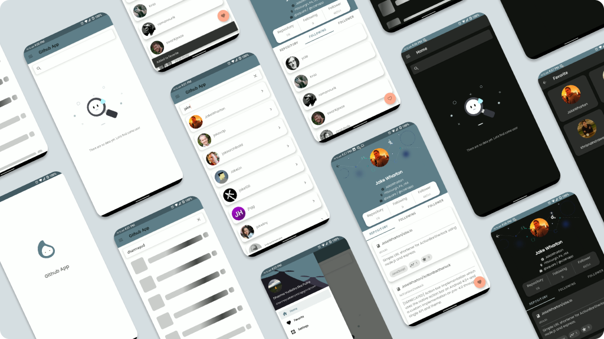
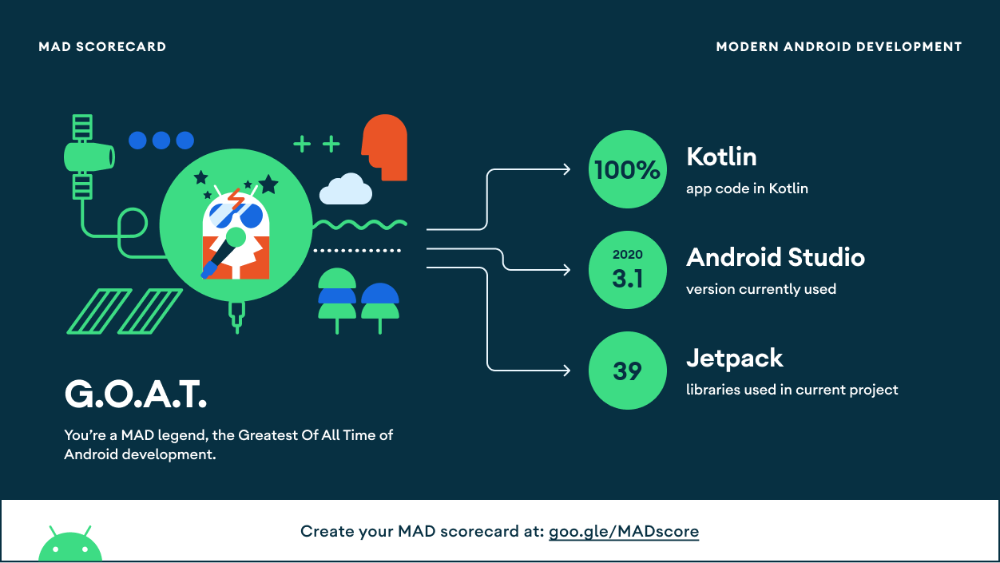

# Github App

[](https://github.com/dharmayudistira/github-app/blob/master/app/build.gradle)
[](https://github.com/dharmayudistira/github-app/blob/master/app/build.gradle)
[](https://github.com/dharmayudistira/github-app/blob/master/app/build.gradle)

> <b>Warning</b>:  Please be wise to clone and learn the flow of the app. You are not allowed to copy/create derivatives/steal/sell this program codes. I am not responsible for anything that happens if you get plagiarized / suspended by [Dicoding](https://www.dicoding.com).

<p align="center">
    
</p>

<p align="center">
    
</p>

## How to clone this project
Generate your github token [here](https://github.com/settings/tokens) and replace this code with your token at **[root]/local.properties**
```kotlin
GITHUB_API_KEY="<<REPLACE WITH YOUR GITHUB TOKEN>>"
```
## How to contribute
I am open for everyone that wants to improve this app. Feel free to pull-req this repository or you can contact me personally via email *dharmayudistira2000@gmail.com*

## Features
- Search User
  - Searching github user using Githup API
- Details User
  - Show details user using Githup API
- Favorite User
  - Add/remove user into/from your favorite list
- Settings
  - Change app theme (dark mode / light mode / follow system)

## Tech Stack
- Programming Language
  - [Kotlin](https://kotlinlang.org/)
- Architecture
  - [Clean Code Architecture by Uncle Bob](http://cleancoder.com/products)
  - [Jetpack MVVM - Repository Pattern](https://developer.android.com/jetpack/guide)
  - Modularization
  - Dynamic Feature
- Jetpack Components
  - [Datastore ](https://developer.android.com/jetpack/androidx/releases/datastore)
  - [Preference](https://developer.android.com/jetpack/androidx/releases/preference)
  - [Room](https://developer.android.com/jetpack/androidx/releases/room)
  - [Lifecycle (LiveData & ViewModel)](https://developer.android.com/jetpack/androidx/releases/lifecycle)
  - [Navigation Component](https://developer.android.com/jetpack/androidx/releases/navigation)
  - [Drawer Layout](https://developer.android.com/jetpack/androidx/releases/drawerlayout)
  - [Material Design Components](https://material.io/develop/android)
  - [ViewPager2](https://developer.android.com/jetpack/androidx/releases/viewpager2)
  - [ViewBinding](https://developer.android.com/topic/libraries/view-binding)
- Networking
  - [Retrofit](https://square.github.io/retrofit/)
  - [OkHttp](http://square.github.io/okhttp/)
  - [Gson Converter](https://github.com/google/gson)
- Other Libraries
  - [AndroidVeil](https://github.com/skydoves/AndroidVeil) - show a list with shimmer animation
  - [Kotlin Flow](https://developer.android.com/kotlin/flow) - reactive data stream
  - [Kotlin Coroutines](https://developer.android.com/kotlin/coroutines) - concurrency that simplifies asynchronous API consumption
  - [Koin V3](https://insert-koin.io/docs/setup/v3) - dependency injection
  - [Lottie Animation](https://github.com/airbnb/lottie-android) - cool & smooth animation 
  - [Coil](https://coil-kt.github.io/coil/) - image loader 

## What's next ?
- Feature
  - [ ] Reminder using work manager
  - [ ] Localization for english - indonesia
  - [ ] Login
- App
  - [ ] Migrate to moshi converter
  - [ ] Implement pagination using Paging 3
  - [ ] Add CI using circleCI
